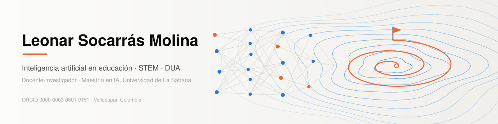

<picture>
  <source media="(prefers-color-scheme: dark)" srcset="assets/banner-oscuro.svg">
  
</picture>

# Leonar Socarrás Molina, PhD

AI Researcher | NLP | Data Science | Educational Innovation | STEM+ | Inclusive Education (DUA)

[ORCID 0000-0003-0601-9151](https://orcid.org/0000-0003-0601-9151) · [LinkedIn](https://www.linkedin.com/in/leonarsocarrasmolina/) · leonarsomo@unisabana.edu.co · Valledupar, Colombia

## About me

I am a Systems Engineer, researcher, and educator with over 20 years of experience in technology, data analysis, and educational innovation.

My work is grounded in a **socio-critical, constructivist, and human-centered perspective**, integrating Artificial Intelligence, Data Science, and Computational Thinking to transform education.

I focus on solving real-world problems in vulnerable and diverse educational contexts through the ethical and meaningful use of technology.

## Research lines

| | Line | What I work on |
|:---:|---|---|
|  | **Artificial Intelligence in Education (AIED)** | AI-driven pedagogical innovation; ethical and human-centered AI |
|  | **Natural Language Processing (NLP)** | Detection of emotions and motivation in students' writing |
|  | **Data Science and Statistical Modeling** | Learning analytics for educational decision-making |
|  | **STEM/STEAM Educational Innovation** | Computational thinking in secondary education |
|  | **Inclusive Education (DUA, Universal Design for Learning)** | Inclusive models for diverse and neurodivergent learners |
|  | **Reinforcement Learning** | Coursework in the MSc in AI: tabular Q-Learning and DQN agents |

**Current research focus:** transformative and inclusive educational models through AI and STEM for diverse and neurodivergent learners.

## Academic background

- Master's Degree in Artificial Intelligence, Universidad de La Sabana (in progress)
- PhD candidate in Education Sciences
- PhD in Sciences (Management)
- Postdoctoral training in Science and Technology Management
- MSc in Control Engineering and Process Automation
- Specialist in Educational Informatics
- Specialist in Pedagogy and Teaching
- Specialist in Participatory Action Research

## Technical skills

- **Programming and data:** Python (NumPy, Pandas, Scikit-learn), R and SPSS, data visualization and exploratory data analysis
- **Artificial intelligence:** machine learning, natural language processing, predictive modeling, reinforcement learning
- **Tools:** Jupyter Notebook and Google Colab, Git and GitHub, Power BI, Arduino and micro:bit

## Featured projects

- **NLP for Educational Analytics.** Analysis of student emotions, motivation, and engagement using NLP techniques.
- **Legal NLP Engine.** Natural Language Processing system for analyzing contracts and supporting decision-making in fiduciary environments.
- **AI + STEM Educational Innovation.** Integration of Artificial Intelligence, computational thinking, and electronics in school environments.
- **Statistical Modeling and Machine Learning.** Comparative analysis of regression models and predictive approaches for data-driven decision-making.

## Educational impact

Teacher and researcher at IE Manuel Germán Cuello Gutiérrez (Valledupar, Colombia): inclusive strategies based on DUA, STEM+ curricula, integration of AI in secondary education, and promotion of critical, reflective, and transformative learning.

## Vision

I aim to contribute to the transformation of education through **ethical, inclusive, and human-centered Artificial Intelligence**, empowering learners as agents of change in their communities.

> "Education, science, and technology must converge to build a more just, inclusive, and conscious society."

Banner and icons: original SVG files in the assets folder of this repository.
